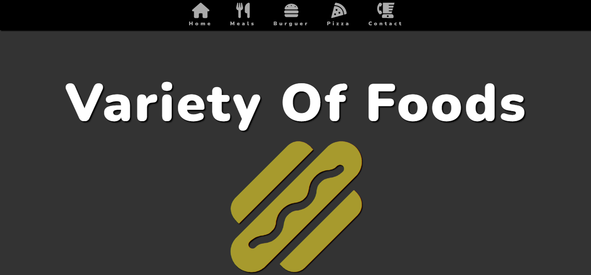
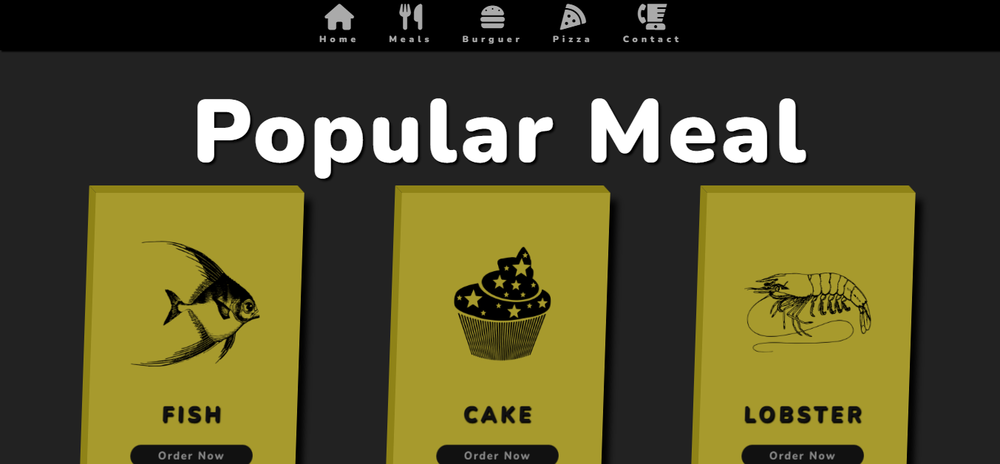
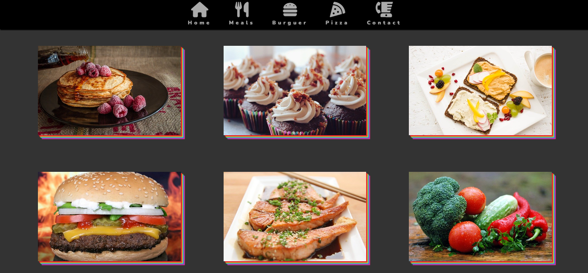
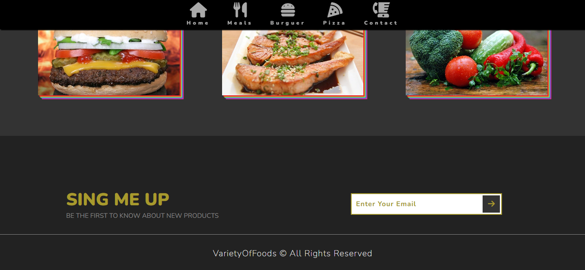

<h1 align="center" style="color: #805ad5; font-weight: bold;">Variety of Food 🍔 🍕 🥪 🌭 🌮</h1>

<p align="center">
 <a href="#tech">Technolgies</a> • 
 <a href="#clone">Clone</a> • 
 <a href="#contribute">Contribute</a> •
 <a href="#license">License</a>
</p>

<p align="center">
<b>This application is a restaurant where you can ask foods!</b>
</p>
<div align="center" >
  <div>
    
    
  </div>
  <div>
    
    
  </div>
</div>


<h2 id="tech">Technologies</h2>

### Client:
  Built using HTML, JS, CSS with pre-processor SCSS.


<h2 id="clone">Clone</h2>

<h4>Starting</h4>

```
git clone https://github.com/Fernanda-Kipper/video-chat.git
```

<h4> Extensions to a better experience</h4>

- Install Live Sass Compiler Extension on vsCode to processor scss at css 
- And Live Server Extension

- At index.html change "link rel="stylesheet" href="styles/main.css" to main.scss

- Start the project with Live Sass Compiler Extension and Live Server Extension to compiler scss to css 
- And so change again to original link rel="stylesheet" href="styles/main.css

<h2 id="contribute">Contribute 🚀</h2>

If you want to contribute, clone this repo, create your work branch and get your hands dirty!

```bash
git clone https://github.com/NascimentoTalesDev/variety-of-foods.git
git checkout -b feature/NAME
```

 At the end, open a Pull Request explaining the problem solved or feature made, if exists, append screenshot of visual modifications and wait for the review!

[How to create a Pull Request](https://www.atlassian.com/br/git/tutorials/making-a-pull-request)

[Commit pattern](https://gist.github.com/joshbuchea/6f47e86d2510bce28f8e7f42ae84c716)


<h2 id="license">License 📃 </h2>

This project is under [MIT](LICENSE) license